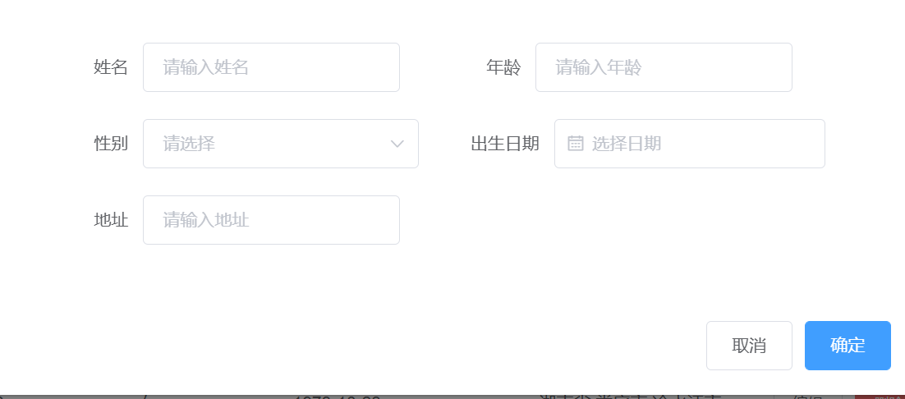

# vue2.0 后台管理系统

## 如何启动(先下载node.js)

```text
在终端输入
npm install
npm run serve
账户	admin
密码	admin
```

# 项目过程

## 安装node.js

可以用npm包管理工具

## 安装其他包管理工具（可省略）

```text
# 安装yarn(他比npm安装速度更快)
npm install -g yarn
#安装淘宝镜像
npm install -g cnpm -registry=https://registry.npm.taobao.org
```

## 安装vue脚手架

```text
npm install -g @vue/cli
# OR
yarn global add @vue/cli
# OR
cnpm install -g @vue/cli
```

## 创建项目

```text
vue create vue-manage
```

## 相关依赖包

注意： vue2的项目要要使用router3版本，现在router的默认版本是4

```text
    "axios": "^0.27.2",	//ajax封装
    "core-js": "^3.8.3", //vue项目自带
    "echarts": "^5.3.3",	//可视化图表
    "element-ui": "^2.15.6",	//基于 Vue 的桌面端组件库
    "js-cookie": "^3.0.1", 		//能设置cookie
    "less": "^4.1.3",		//less语法
    "less-loader": "^6.2.0",	//支持css less语法
    "mockjs": "^1.1.0",		//生成随机数据，拦截 Ajax 请求
    "vue": "^2.6.14",  //vue
    "vue-router": "^3.5.4",   //路由
    "vuex": "^3.6.2"     //管理共享状态
    
    其中需要手动安装的是axios,echarts,element-ui,js-cookie,less,less-loader,mockjs,vue-router,vuex,
    具体安装方法看官方文档
```

# 项目结构

## api

### mockServerData

#### home

```js
getStatisticalData
图表数据
用mock取随机数据List
```

#### permission

```js
判断账户和密码是否存在并正确
```

#### user

 ```js
 用户列表搜索和添加编辑删除
 ```

### axios

```javascript
对axios进行二次封装
```

### data

```javascript
用axios发送ajax请求
```

### mock

```javascript
拦截ajax请求,传数据
import Mock from 'mockjs'
import homeApi from './mockServerData/home'
import userApi from './mockServerData/user'
import permissionApi from './mockServerData/permission'
Mock.mock('/home/getData', homeApi.getStatisticalData)
Mock.mock('/user/add', 'post', userApi.createUser)
Mock.mock(/user\/edit/, 'post', userApi.updateUser)
Mock.mock(/user\/getUser/, 'get', userApi.getUserList)
Mock.mock('/user/del', 'post', userApi.deleteUser)
Mock.mock(/permission\/getMenu/,'post',permissionApi.getMenu)
```

## config

在axios二次封装中设置baseURL

判断是开发环境还是生产环境

```text
export default {
    baseUrl:{
        dev: '/api',
        pro:''
    }
}
```

## src

## assets

```text
静态资源
一些图片和less文件
```

## components

### home


```javascript
userImg用户头像
tableData左下角数据列表
tableLabel左下角数据标题
countData右上角数据
mounted
  getData
    从api/home.js获取数据加入到echarts图
```

### login


```javascript
getMenu执行permisson.js获取用户身份
```

### mall


```javascript
无
```

### other

pageOne


```javascript
无
```

pageTwo


```javascript
无
```

### user


```text
  components: {
    CommonForm,
 	CommonTable
  }
用getUser从api/mockServerData/user.js获取用户名单
```

### aisdeshow


```javascript
通过store的state.menu获取菜单列表
```

### commonform



```javascript
在父组件isShow中判断是否显示
```

### commontable


```javascript
在/api/mockServerData/user.js中getUserList获取数据
```

### commontag


```javascript
面包屑
数据和方法在store中
```

### headershow


```javascript
数据和方法在store中,最右边头像有登出选项
```

### mainshow

```javascript
//3个组件
components: {
    AsideShow,
    HeaderShow,
    CommonTag
}
//还有一个路由  <router-view></router-view>
```

## router

```javascript
路由包括
Mainshow通用后台管理系统
  home首页
    user用户管理
    mall商品管理
    page1页面1
    page2页面2
  login登录界面

MainShow里有 redirect:'/home',
所以进入系统首先显示的子路由home首页
路由默认根目录是path:'/'
```


## store

```javascript
state{
    isCollapse//判断左侧导航栏是否收缩
    token//判断登录状态
    tabsList//面貌屑数据
    currentMenu//当前菜单哪一个位置
    menu //左侧导航栏菜单内容
}
mutations{
    collapseMenu	//判断左侧导航栏是否收缩
    selectMenu		//更新面包屑数据
    closeTag  //关闭面包屑
    
    setMenu	//设置左侧导航栏菜单内容
    clearMenu	//清除左侧导航栏菜单内容
    addMenu		//根据menu添加左侧导航栏菜单内容
    
    setToken//设置token
    clearToken//清除token
    getToken//获取token
}
```


## App.vue

```text
<router-view></router-view>
写在组件想要渲染的地方,等组件跳转过来就渲染
```


## main.js

```javascript
导入要用的东西

Vue.prototype.$axios=axios
//每个Vue实例中可用axios

Vue.use和Vue.prototype区别
//https://blog.csdn.net/qq_36935391/article/details/124215947


路由守卫
router.beforeEach
在切换路由时用来验证是否处于登录状态(获取token判断，token存储在store的state和cookie中)
路由默认根目录是path:'/'


    created() {
      store.commit('addMenu', router)  //   //根据用户权限添加左侧导航栏菜单内容
      								   //刷新白屏的解决方法:在 vue实例生成前， created 钩子中调用动态路由的方法。
    },
    router,
    store
```
